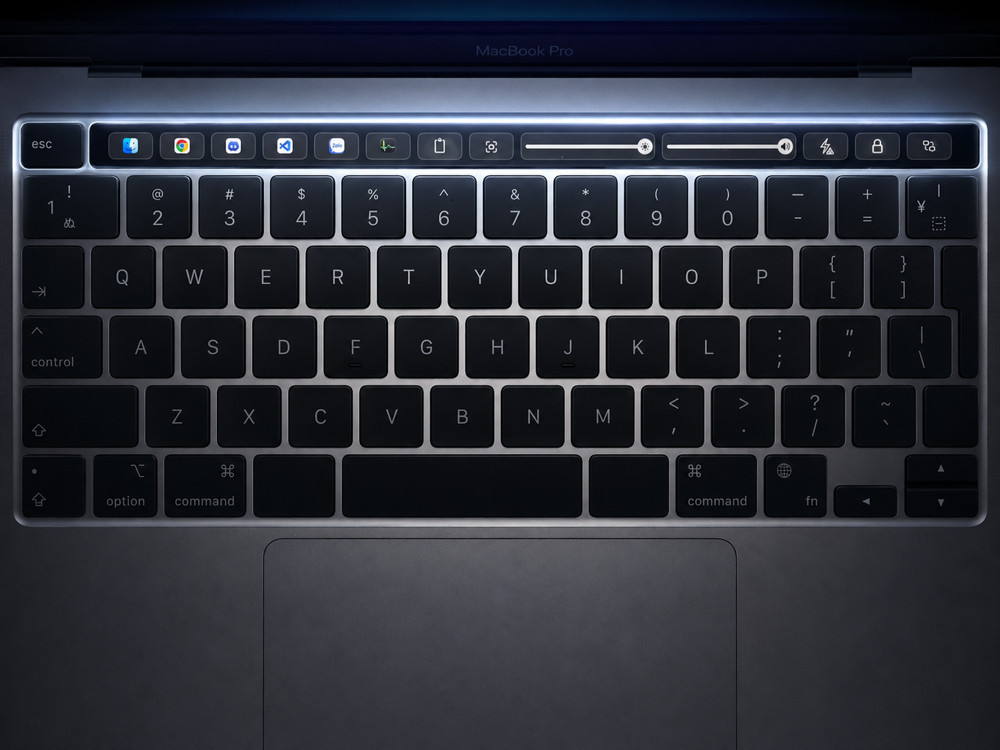
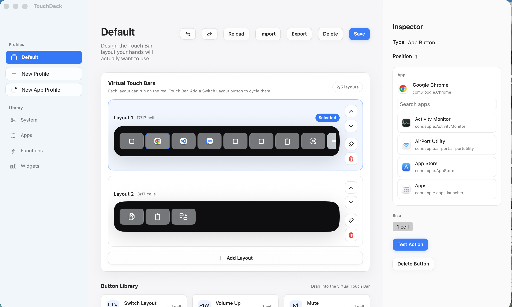
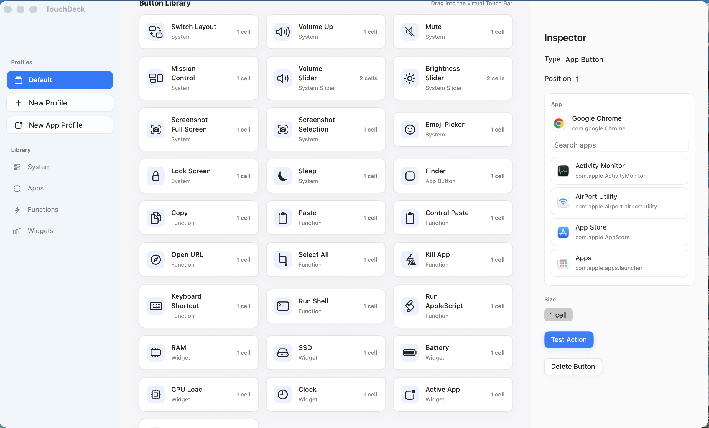
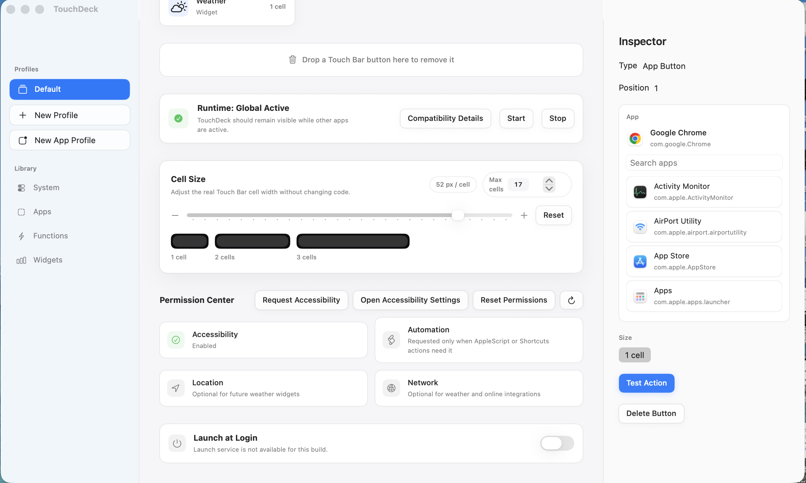

# TouchDeck

TouchDeck is a macOS app that turns the MacBook Pro Touch Bar into a Stream Deck-style control surface. It lets users arrange real Touch Bar buttons through an in-app virtual Touch Bar, drag buttons in and out, create multiple layouts, switch layouts, launch or focus apps, run shortcuts, control system actions, and view machine stats.

The app is designed as a native, minimal, premium macOS experience inspired by System Settings, Finder, Xcode, TestFlight, Raycast, Arc Browser, CleanShot X, Linear, and Notion Calendar.

## Demo









## Key Features

- Virtual Touch Bar editor with drag-and-drop layout editing.
- Global Touch Bar runtime so TouchDeck layouts can stay visible while other apps are frontmost.
- Up to 5 parallel layouts.
- Switch Layout button for cycling between layouts.
- Required Switch Layout rules when multiple layouts exist, so users do not get stuck on one layout.
- Dock-like App Buttons: launch apps, focus running apps, and unhide hidden apps.
- App discovery from `/Applications`, `~/Applications`, `/System/Applications`, `/System/Applications/Utilities`, and `/Applications/Utilities`.
- Function Buttons for copy, paste, control paste, undo, redo, select all, opening URLs, opening files or folders, shell commands, AppleScript, macOS Shortcuts, and current-app actions.
- System Buttons for volume, brightness, mute, media controls, Mission Control, Launchpad, screenshots, emoji picker, lock screen, and sleep.
- Volume and brightness sliders with compact Touch Bar-native styling.
- Percentage widgets for RAM, SSD, CPU, and battery usage, with color-coded values.
- RAM widget click action opens Activity Monitor.
- Default profiles and app-specific profiles based on the frontmost app.
- JSON profile save, import, and export.
- Menu bar runtime controls for starting, stopping, and re-presenting the Touch Bar.
- Test coverage for core rules, profile storage, app discovery, layout editing, and the Studio store.

## Button Design Rules

TouchDeck uses compact rendering rules for the real Touch Bar:

- Most default buttons are 1 cell and icon-only.
- Sliders can use wider layouts.
- App Buttons are always 1 cell and display only the app icon.
- Percentage widgets display only the percentage value, without a logo.
- Percentage colors are tiered by usage:
  - `0-20%`: green
  - `20-40%`: mint
  - `40-60%`: yellow
  - `60-80%`: orange
  - `80-100%`: red

## System Requirements

- macOS 14 or later.
- A MacBook Pro with Touch Bar for full runtime testing.
- Swift 6 / Xcode toolchain compatible with Swift Package Manager.

Some actions require system permissions:

- Accessibility: keyboard shortcuts, Mission Control, screenshots, emoji picker, and some system actions.
- Automation: AppleScript, volume slider behavior, and app-control actions.
- Location/Network: optional weather widgets.

## Build And Run

Run tests:

```bash
swift test
```

Build the SwiftPM binary:

```bash
swift build -c release --product TouchDeck
```

Package a local `.app` bundle:

```bash
./scripts/package_app.sh
```

The app bundle is created at:

```text
dist/TouchDeck.app
```

Open the app:

```bash
open dist/TouchDeck.app
```

Verify local code signing:

```bash
codesign --verify --deep --strict --verbose=2 dist/TouchDeck.app
```

## Developer ID Signing

By default, the packaging script uses ad-hoc signing for development. To sign with a Developer ID identity:

```bash
CODESIGN_IDENTITY="Developer ID Application: Your Name (TEAMID)" ./scripts/package_app.sh
```

See the release checklist in [docs/distribution.md](docs/distribution.md).

## Project Structure

```text
Sources/
  TouchDeckApp/       App entry point.
  TouchDeckCore/      Models, catalogs, profile store, validation, app discovery, stats.
  TouchDeckRuntime/   Global Touch Bar runtime, renderer, action dispatcher.
  TouchDeckStudio/    Editor UI, layout store, drag and drop, inspector.

Tests/
  TouchDeckCoreTests/
  TouchDeckStudioTests/

Packaging/
  Info.plist
  TouchDeck.entitlements
  TouchDeck.icns

docs/
  beta-qa.md
  distribution.md
```

## Architecture

TouchDeck is split into four modules:

- `TouchDeckCore`: shared data and rules, including `TouchBarProfile`, `TouchBarPage`, `TouchBarItemConfig`, action/widget/function catalogs, app discovery, profile codecs, and validation.
- `TouchDeckRuntime`: renders layouts onto the real Touch Bar, dispatches actions, updates widgets, and manages the global runtime.
- `TouchDeckStudio`: native SwiftUI/AppKit editor, virtual Touch Bar, drag-and-drop layout editing, and inspector UI.
- `TouchDeckApp`: app bootstrap, window setup, menu bar runtime controls, and Studio-to-Runtime wiring.

Profiles are stored as JSON in Application Support through `ProfileStore`. When profiles are loaded, saved, or rendered, they are normalized against the current rules so older layouts keep rendering correctly.

## Global Touch Bar

TouchDeck aims to provide an always-available Touch Bar experience similar to tools such as MTMR. This depends on private macOS Touch Bar presentation behavior, so:

- Direct distribution with Developer ID signing and notarization is recommended.
- App Store distribution should not be expected while the app depends on global/private Touch Bar presentation.
- macOS updates may change runtime behavior.
- The app should keep a clear fallback path when global runtime is unavailable.

## QA

The detailed beta checklist lives in [docs/beta-qa.md](docs/beta-qa.md).

Important checks on real Touch Bar hardware:

- Layouts stay visible when switching to Finder, Safari, Xcode, or other apps.
- App Buttons launch, focus, and unhide apps correctly.
- Copy/paste affects the frontmost app, not TouchDeck Studio.
- Volume and brightness sliders respond smoothly.
- RAM widget opens Activity Monitor when clicked.
- Switch Layout works in every layout.
- App-specific profiles switch based on the frontmost app.

## Status

TouchDeck is currently an internal prototype/beta. The core feature foundation is in place, but it still needs more QA on real Touch Bar hardware, especially around global runtime behavior, Accessibility/Automation permissions, and macOS version compatibility.

## License

TouchDeck is released under the GNU General Public License v3.0 or later. See [LICENSE](LICENSE) for details.
